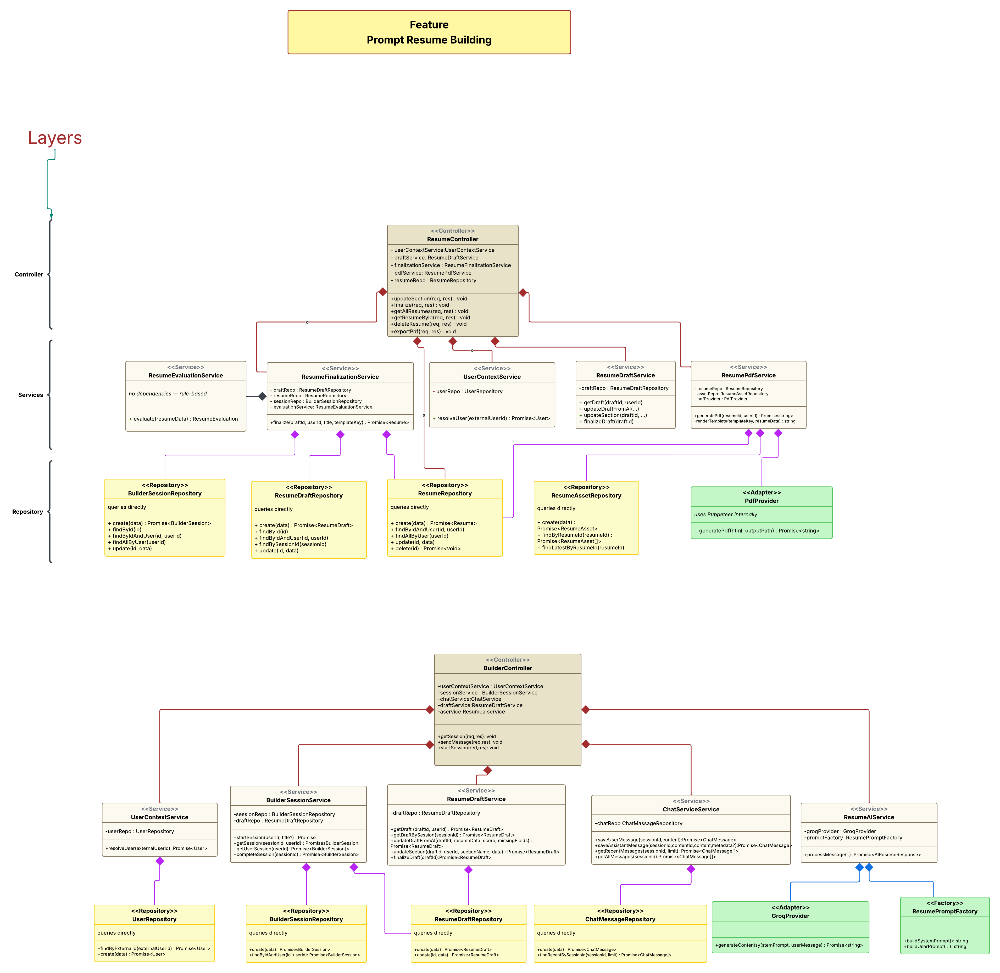
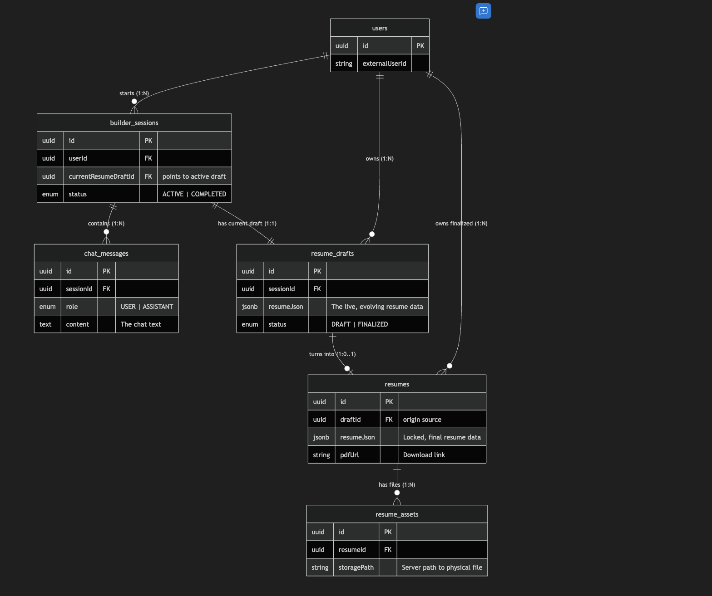

# AI Resume Builder System Architecture

This document provides a high-level overview of the system architecture, including Use Case flows, Class designs, and Database schemas. It is meant to be the single source of truth for understanding how the backend operates.

---

## 1. Use Case Diagram

### Overview
This diagram illustrates the boundaries of the system from the perspective of external actors (**User**, **Groq AI**, and **Puppeteer**). 

**Key Flows:**
1.  **UC1: Start Resume Session**: Creates a new operational session and an empty draft in the database.
2.  **UC2: Chat with AI**: The core loop where the User sends a message, and the system communicates with the external Groq LLM API to return structured resume data.
3.  **UC3: Manually Edit Section**: Allows the user to directly inject updates into isolated sections (like 'skills' or 'education') bypassing the AI.
4.  **UC5: Finalize Resume**: Freezes the draft into an immutable `resumes` record.
    *   *Includes* **UC4 (Evaluate Resume)**: Rule-based validation ensures the resume meets minimum standards before it can be finalized.
5.  **UC6: Generate & Download PDF**: Delegates the heavy lifting of rendering HTML templates to PDF via an isolated Puppeteer process.

---

## 2. Class Architecture

### Strict Layered Design

The architecture follows a strict Layered/Controller-Service-Repository pattern. It utilizes the following structural paradigms:

#### **Composition Over Aggregation**
Notice the strict use of the **Solid Diamond (Composition - `*--`)** throughout the diagram. 
Because this backend does not use an external Dependency Injection framework (like NestJS), dependencies are instantiated manually inside the `constructor()` of each parent class (e.g., `this.service = new Service()`). Therefore, the parent class strictly owns the lifecycle of its dependencies (Composition), rather than just holding a reference to an independently created object (Aggregation).

#### **Design Patterns Used**
1.  **Repository Pattern** (`UserRepository`, `ResumeDraftRepository`, etc.): Abstract database interactions so Services don't write raw SQL or Drizzle queries.
2.  **Adapter/Provider Pattern** (`GroqProvider`, `PdfProvider`): Wrap third-party NPM SDKs so they can easily be swapped out (e.g., swapping Groq for OpenAI) without changing internal business logic.
3.  **Factory Pattern** (`ResumePromptFactory`): Isolates complex dynamic string building (System Prompts, Context injection) away from the clean orchestration logic of the AI Service.
4.  **Facade Pattern** (`ResumeAIService`): Exposes a single, simplified method (`processMessage`) to the Controller while handling highly complex multi-service orchestration underneath.

#### **SOLID Principles**
*   **Single Responsibility (SRP):** Classes do exactly one thing. `ChatService` handles history. `GroqProvider` talks to LLMs.
*   **Dependency Inversion (DIP):** Controllers depend on high-level Service abstractions, while Services orchestrate Repositories, isolating the Controllers from the database.

---

## 3. Database Architecture & Data Lifecycle

We use **Neon Postgres** for our database. The system is built around 6 core tables. 

### Entity-Relationship (ER) Diagram

### Table-by-Table Breakdown

1.  **`users`**: Represents an external person using the app. Bridges the frontend user (e.g., via OAuth) with our internal `UUID`.
2.  **`builder_sessions`**: Represents one isolated "conversation event". Links back to a user and tracks active versus completed sessions.
3.  **`resume_drafts`**: Holds the **mutable (changeable)** resume data in real-time tracking progression.
    *   *JSONB Power:* Instead of 50 individual schema columns, all data is mapped into a strictly typed `JSONB` column structure holding a large nested object (`ResumeData`). Every AI action intelligently merges data into this JSON chunk.
4.  **`chat_messages`**: Because LLMs have no persistence, this logs every single conversational dialogue between the `USER` and the `ASSISTANT` so context can be rebuilt on-the-fly.
5.  **`resumes`**: Holds **immutable (locked)** resumes. Created only when a User finalizes a Draft. A finalized resume cannot be altered by further chats, cementing its state in time.
6.  **`resume_assets`**: Tracks physical server-side generated documents (PDFs) correlating to specific Immutable Resumes.

### The Data Lifecycle Example Flow

1.  **Initialization**: User logs in. Backend creates a row in `users`. They click "Start New Resume", creating a `builder_sessions` row and an empty `resume_drafts` row linked 1:1.
2.  **Building**: User sends "I worked at Google in 2022". Backend writes to `chat_messages`. The system passes history + the current JSON to Groq AI. Backend parses the output and **OVERWRITES** the `resume_drafts` JSON slot with the newly merged data. The AI response is saved back to `chat_messages`.
3.  **Finalization**: User clicks finalize. System checks validity. If it passes, it copies the JSON from the Draft into a brand new `resumes` row and permanently locks the Draft status.
4.  **Exporting**: User requests a PDF. The system reads the locked JSON from `resumes`, converts it to styled HTML, renders the PDF, saves the file location in `resume_assets`, and updates the download link (`pdfUrl`) in `resumes`.
